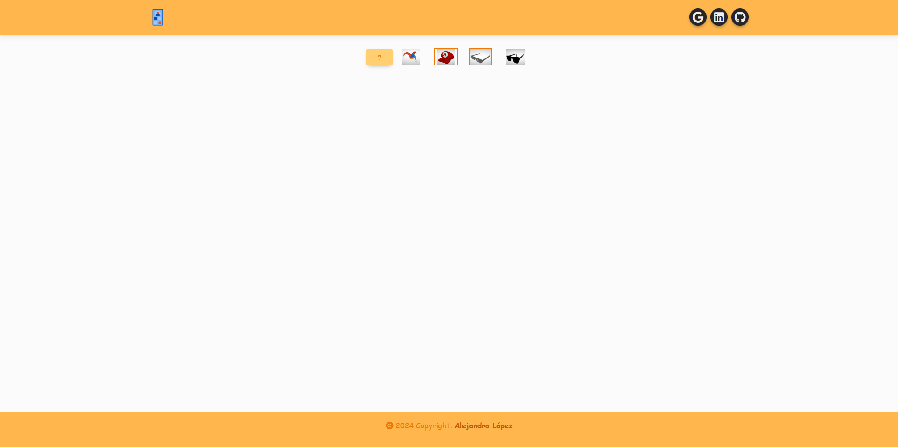
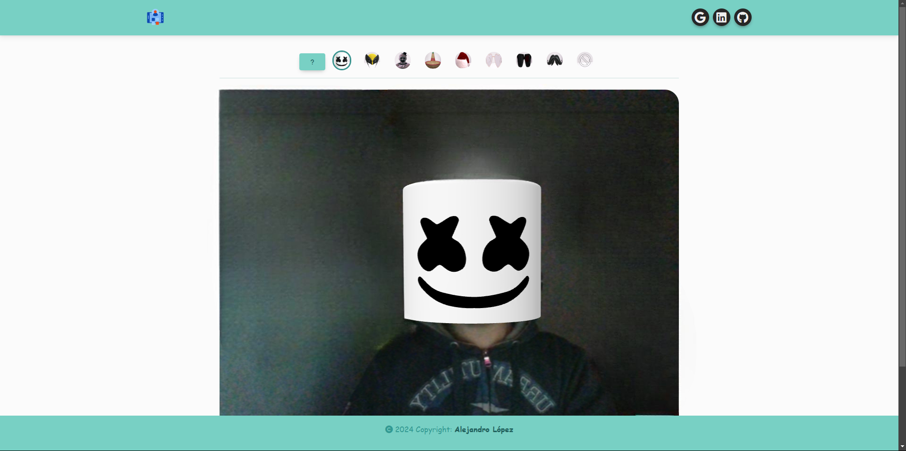

# <h1 align="center" style="color: #80cbc4;"> AR 3D Face Tracking 👨🏻‍💻 </h1> 
  

` A-Frame ` is an open source framework for creating virtual reality experiences on the web, and is based on HTML. A-Frame is compatible with technologies such as WebVR and WebXR, allowing the creation of VR experiences accessible through a browser.
 

` Face tracking ` in A-Frame refers to the ability to detect and track the movements of the user's face via the webcam, and use this information to manipulate or interact with objects within a virtual or augmented reality environment.

 

  

## 
 Requirements 

- [HTML5](https://developer.mozilla.org/es/docs/Web/HTML) 
- [CSS3](https://developer.mozilla.org/es/docs/Web/CSS)
- [JavaScript](https://developer.mozilla.org/es/docs/Web/JavaScript)
- [BootStrap](https://mdbootstrap.com/)
- [MindAR](https://hiukim.github.io/mind-ar-js-doc/)
- [Face tracking ](https://hiukim.github.io/mind-ar-js-doc/face-tracking-quick-start/overview)

  

## 
 Screenshot Project 💻 

🔶 [Project Website](https://alejandro-190107.github.io/AR-3D-Face-Tracking/)
🔶 [Another Version](https://ar-3d-face-tracking-al.netlify.app/)

